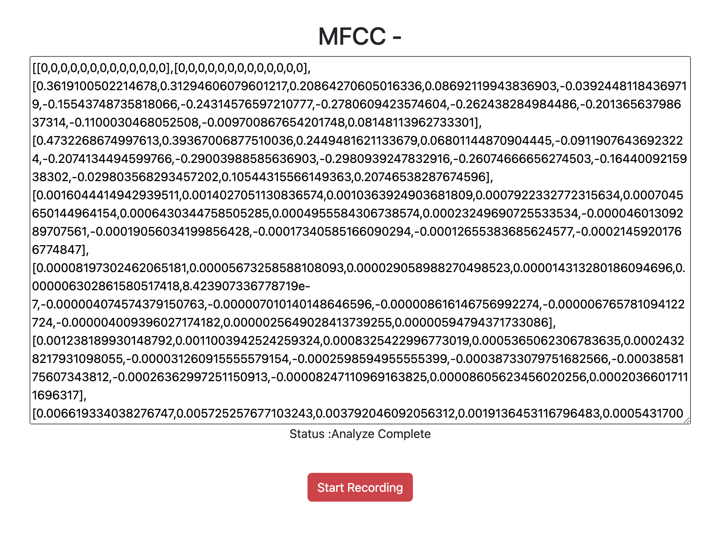

# Audio Recording and MFCC Extraction

This project demonstrates how to record audio from the microphone using web browser APIs and extract Mel-Frequency Cepstral Coefficients (MFCC) features from the recorded audio.

## Features

- Start and stop recording audio from the microphone.
- Analyze the recorded audio to extract MFCC features.
- Display the extracted MFCC features in a text area.

## Usage

1. Clone the repository to your local machine.

2. Open the `index.html` file in a web browser.

3. Click on the "Start Recording" button to begin recording audio from your microphone.

4. After recording, the status will change to "Analyzing ..." indicating that the recorded audio is being analyzed to extract MFCC features.

5. Once the analysis is complete, the extracted MFCC features will be displayed in the text area.

6. You can click on the "Start Recording" button again to start a new recording.

## Requirements

- A web browser that supports the MediaRecorder API (such as Google Chrome, Mozilla Firefox, or Microsoft Edge).
- Microphone access permission granted to the web browser.

## Dependencies

- [Meyda.js](https://github.com/meyda/meyda) - A JavaScript library for audio feature extraction.

## Output 

